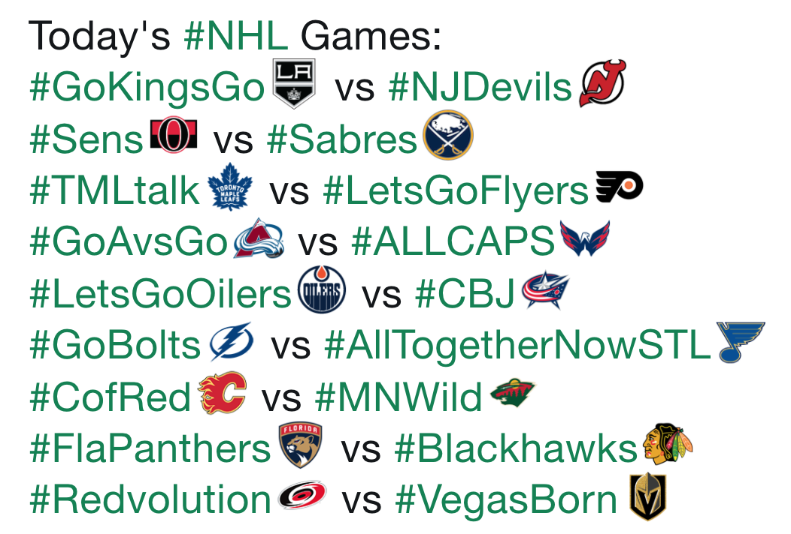

```{r setup, include=FALSE, echo = FALSE, message = FALSE}
knitr::opts_chunk$set(echo = FALSE)
 #Commented code is available in Mining.R file -- run this code first 
#Loading all the libraries needed for various data visualization:

x <- c("tidyverse", "tidytext", "purrr", "twitteR", "ROAuth", "devtools", 
       "stringr", "RColorBrewer", "wordcloud", "gridExtra", "tm", 
       "sp", "RgoogleMaps", "ggmap", "maptools", "tigris", "leaflet", 
       "webshot", "RCurl", "reshape2", "scales", "kableExtra", "knitr");

lapply(x, library, character.only = TRUE);

#Load data saved by Mining.R
load('alltweets.RData')
load('badtweet.RData')
load('goodtweet.RData')
load('neutraltweet.RData')
load('teaminfo.RData')
load('teamsentiments.RData')
load('sentimentdesign.RData')
```

## The Wonderful World of the NHL {.smaller}
(Minus the newest expansion team, Vegas Golden Knights)


##What's So Special? {.smaller}
<center>

</center>


Every team has their own specific hashtag! When you use the hashtag, their logo appears alongside.
This encourages more people to use the hashtag, and interact with the team and fellow fans.


##But What Does That Mean? {.smaller}
  - We can look at Tweets separated by the hashtag they use in order to get more information about     attitudes regarding the team
  - We can see if interactions on Twitter, use of hashtags, sentiment analysis of Tweets etc. is       indicative of team performance
  - Hockey fans are fun; they normally have something amusing to say, so reading the Tweets is cool
<center>

</center>
  
##Word Clouds for Sentiment Analysis: "Good Teams" {.smaller}

```{r, echo = FALSE, warning = FALSE, message = FALSE, fig.cap = "Word Frequency for Good Teams"}
myCorpus <- Corpus(VectorSource(GoodTweets$text))
myStopwords <- myStopwords
myCorpus <- tm_map(myCorpus, removeWords, myStopwords)
myCorpusCopy <- myCorpus

GoodTweetText <- GoodTweets$text

Good.df <- data_frame(line=1:4000, text = GoodTweetText)
Good.df <-  Good.df %>% unnest_tokens(word, text) %>%
  anti_join(custom_stop_words)


Goodplot = 
  Good.df %>%
  count(word, sort = TRUE) %>%
  top_n(20) %>%
  mutate(word = reorder(word, n)) %>%
  ggplot(aes(word, n)) +
  geom_col(stat='identity', fill='darkseagreen2') +
  xlab(NULL) +
  ggtitle('"Good Teams" Word Count') +
  coord_flip()


afinnGOOD <- Good.df %>% 
  inner_join(customsentiments)
GoodSentimentScore <- sum(afinnGOOD$score)
GOODAvg <-mean(afinnGOOD$score)


tdm <- TermDocumentMatrix(myCorpus, control = list(wordLengths = c(1, Inf)))
tdm <- as.matrix(tdm)

# calculate the frequency of words and sort it by frequency
word.freq <- sort(rowSums(tdm), decreasing = T)
wordcloud(words = names(word.freq), freq = word.freq, min.freq = 20,
random.order = F, scale = c(5, .2), colors = brewer.pal(10, "Dark2")) 

```
##Distribution of Sentiment Scores: "Good Teams" {.smaller}

```{r, echo = FALSE, warning = FALSE, message = FALSE, fig.cap = "Comparison Cloud of Sentiment Scores for Good Teams"}

Good.df %>% 
  inner_join(customsentiments) %>%
  count(word, score, sort=TRUE) %>%
  acast(word~score, value.var = "n", fill =0) %>%
  comparison.cloud(max.words = 200)
```


##Word Clouds for Sentiment Analysis: "Bad Teams" {.smaller}
```{r, echo = FALSE, warning = FALSE, message = FALSE, fig.cap = "Word Frequency for Bad Teams"}
myCorpus2 <- Corpus(VectorSource(BadTweets$text))
myStopwords <- myStopwords
myCorpus2 <- tm_map(myCorpus2, removeWords, myStopwords)
myCorpusCopy2 <- myCorpus2


BadTweetText <- BadTweets$text

Bad.df <- data_frame(line=1:4000, text = BadTweetText)

Bad.df <-  Bad.df %>% unnest_tokens(word, text) %>%
  anti_join(custom_stop_words)


Badplot = 
  Bad.df %>%
  count(word, sort = TRUE) %>%
  top_n(20) %>%
  mutate(word = reorder(word, n)) %>%
  ggplot(aes(word, n)) +
  geom_col(fill='tomato2') +
  xlab(NULL) +
  ggtitle('"Bad Teams" Word Count') +
  coord_flip()


afinnBAD <- Bad.df %>% 
  inner_join(customsentiments)
BadSentimentScore<- sum(afinnBAD$score)
BADAvg <- mean(afinnBAD$score)


tdm2 <- TermDocumentMatrix(myCorpus2, control = list(wordLengths = c(1, Inf)))
m2 <- as.matrix(tdm2)

# calculate the frequency of words and sort it by frequency
word.freq2 <- sort(rowSums(m2), decreasing = T)
wordcloud(words = names(word.freq2), freq = word.freq2, min.freq = 20,
random.order = F, scale = c(5, .2), colors = brewer.pal(10, "Dark2")) 

```
##Distribution of Sentiment Scores: Bad Teams

```{r, echo = FALSE, warning = FALSE, message = FALSE, fig.cap = "Comparison Cloud of Sentiment Scores for Bad Teams"}

Bad.df %>% 
  inner_join(customsentiments) %>%
  count(word, score, sort=TRUE) %>%
  acast(word~score, value.var = "n", fill =0) %>%
  comparison.cloud(max.words = 200)

``` 

##Average Sentiment Per Team {.smaller}

```{r, echo = FALSE, warning = FALSE, results = FALSE, message = FALSE, fig.cap = "Comparison of Average Sentiment Scores by Team"}
ggplot(data=TeamInfo, aes(x= TeamNames, y= avgSentimentScore, fill=TeamNames)) +
  geom_bar(stat="identity") +
  theme(axis.text.x = element_text(angle = 70, hjust = 1),legend.position = "none") +
  geom_hline(aes(yintercept=mean(TeamInfo$avgSentimentScore))) +
  labs(title = "Average Sentiment Score by Team", y = "Average Sentiment", x = "Team Name")
```

##Correlation of Sentiment & Points {.smaller}
<div class="centered">Correlation = 0.025</div>
```{r, echo = FALSE, warning = FALSE, message = FALSE, fig.cap = "Scatterplot of correlation between average sentiment score and current number of points"}
ggplot(data=TeamInfo, aes(x= Points, y=avgSentimentScore)) +
  geom_point(aes(colour=TeamInfo$Division), size=3, show.legend = TRUE) +
  labs(title = "Points vs. Sentiment Score", y = "Average Sentiment Score", x = "Current Number of Points") + 
  scale_color_manual(values=c("royalblue4", "orchid2", "firebrick3", "turquoise"), name = "Division")

```

##Map of All Negative Sentiment Use {.smaller}

```{r, echo = FALSE, warning = FALSE, message = FALSE, fig.cap = "Frequency of negative sentiments used for all teams"}
AFINN <- rbind(Lightningafinn, Devilsafinn, Kingsafinn, Predsafinn, Leafsafinn, 
     BlueJacketsafinn, Jetsafinn, GKafinn, Habsafinn, Bruinsafinn, RedWingsafinn, 
     Sensafinn, Islandersafinn, Pensafinn, Bluesafinn, Starsafinn, Wildafinn, 
     Canucksafinn, Sharksafinn, Flamesafinn, Ducksafinn, Rangersafinn, Capsafinn, 
     Sabresafinn, Flyersafinn, Avalancheafinn, Coyotesafinn, Panthersafinn, Hawksafinn, 
     Oilersafinn, Canesafinn)

neg5 <- AFINN %>% filter(score== -5) 
neg4 <- AFINN %>% filter(score== -4)
neg3 <- AFINN %>% filter(score== -3)
neg2 <- AFINN %>% filter(score== -2)
neg1 <- AFINN %>% filter(score== -1)
pos1 <- AFINN %>% filter(score== 1)
pos2 <- AFINN %>% filter(score== 2)
pos3 <- AFINN %>% filter(score== 3)
pos4 <- AFINN %>% filter(score== 4)
pos5 <- AFINN %>% filter(score== 5)

neg <- rbind(neg5, neg4, neg3, neg2, neg1)
pos <- rbind(pos1, pos2, pos3, pos4, pos5)

posssss <- pos %>% count(latitude, longitude)

neggg1 <- neg1 %>% count(latitude, longitude)
neggg2 <- neg2 %>% count(latitude, longitude)
neggg3 <- neg3 %>% count(latitude, longitude)
neggg4 <- neg4 %>% count(latitude, longitude)
neggg5 <- neg5 %>% count(latitude, longitude)

posss1 <- pos1 %>% count(latitude, longitude)
posss2 <- pos2 %>% count(latitude, longitude)
posss3 <- pos3 %>% count(latitude, longitude)
posss4 <- pos4 %>% count(latitude, longitude)
posss5 <- pos5 %>% count(latitude, longitude)

map <- get_googlemap(center = c(lon = -97.3439293, lat = 41.1873422), size = c(640, 500),
zoom = 4, maptype = 'roadmap', color = 'bw')

met <- get_googlemap(center = c(lon = -73.9655909, lat = 40.6853413), size = c(640, 500), 
                      zoom = 10, maptype = 'roadmap', color = 'bw')

socal <- get_googlemap(center = c(lon = -117.7769965, lat = 34.0565805), size = c(640, 640), 
                      zoom = 9, maptype = 'roadmap', color = 'bw')

ggmap(map) +
  geom_point(aes(x = longitude, y = latitude, colour = "-1", size = n),shape =1, alpha = 1, data = neggg1) +
  geom_point(aes(x = longitude, y = latitude, colour = "-2", size = n), shape =1, alpha = 1, data = neggg2) +
  geom_point(aes(x = longitude, y = latitude, colour = "-3", size = n), shape =1, alpha = 1, data = neggg3) +
  geom_point(aes(x = longitude, y = latitude, colour = "-4", size = n), shape =1, alpha = 1, data = neggg4) +
  geom_point(aes(x = longitude, y = latitude, colour = "-5", size = n), shape =1, alpha = 1, data = neggg5) +
  scale_size(range = c(0,7), name = "Number of Words") +
  scale_color_manual(values=c("dodgerblue4", "mediumspringgreen", "deeppink4", "lightslateblue", "grey0"), name = "Sentiment Rating") +
  labs(title='Distribution of Negative Sentiments', x = "Longitude", y = "Latitude")

```

##Negative Sentiment Use in New York {.smaller}
```{r, echo = FALSE, warning = FALSE, message = FALSE, fig.cap = "Frequency of negative sentiments used for all teams: zoom on tri-city area"}


ggmap(met) +
  geom_point(aes(x = longitude, y = latitude, colour = "-1", size = n),shape =1, alpha = 1, data = neggg1) +
  geom_point(aes(x = longitude, y = latitude, colour = "-2", size = n), shape =1, alpha = 1, data = neggg2) +
  geom_point(aes(x = longitude, y = latitude, colour = "-3", size = n), shape =1, alpha = 1, data = neggg3) +
  geom_point(aes(x = longitude, y = latitude, colour = "-4", size = n), shape =1, alpha = 1, data = neggg4) +
  geom_point(aes(x = longitude, y = latitude, colour = "-5", size = n), shape =1, alpha = 1, data = neggg5) +
  scale_size(range = c(0,20), name = "Number of Words") +
  scale_color_manual(values=c("dodgerblue4", "mediumspringgreen", "deeppink4", "lightslateblue", "grey0"), name = "Sentiment Rating") +
  labs(title='Distribution of Negative Sentiments in Tri-City Area', x = "Longitude", y = "Latitude")
```

##Negative Sentiment Use in S. California {.smaller}
```{r, echo = FALSE, warning = FALSE, message = FALSE, fig.cap = "Frequency of negative sentiments used for all teams: zoom on Southern California"}
ggmap(socal) +
  geom_point(aes(x = longitude, y = latitude, colour = "-1", size = n),shape =1, alpha = 1, data = neggg1) +
  geom_point(aes(x = longitude, y = latitude, colour = "-2", size = n), shape =1, alpha = 1, data = neggg2) +
  geom_point(aes(x = longitude, y = latitude, colour = "-3", size = n), shape =1, alpha = 1, data = neggg3) +
  geom_point(aes(x = longitude, y = latitude, colour = "-4", size = n), shape =1, alpha = 1, data = neggg4) +
  geom_point(aes(x = longitude, y = latitude, colour = "-5", size = n), shape =1, alpha = 1, data = neggg5) +
  scale_size(range = c(0,20), name = "Number of Words") +
  scale_color_manual(values=c("dodgerblue4", "mediumspringgreen", "deeppink4", "lightslateblue", "grey0"), name = "Sentiment Rating") +
  labs(title='Distribution of Negative Sentiments in Southern California', x = "Longitude", y = "Latitude")

```

##Map of All Positive Sentiment Use {.smaller}
```{r, echo = FALSE, warning = FALSE, message = FALSE, fig.cap = "Frequency of positive sentiments used for all teams"}

ggmap(map) +
  geom_point(aes(x = longitude, y = latitude, colour = "1", size = n), shape =1, data = posss1) +
  geom_point(aes(x = longitude, y = latitude, colour = "2", size = n), shape =1, data = posss2) +
  geom_point(aes(x = longitude, y = latitude, colour = "3", size = n), shape =1, data = posss3) +
  geom_point(aes(x = longitude, y = latitude, colour = "4", size = n), shape =1,  data = posss4) +
  geom_point(aes(x = longitude, y = latitude, colour = "5", size = n), shape =1, data = posss5) +
  scale_size(range = c(0,7), name = "Number of Words") +
  scale_color_manual(values=c("darkturquoise", "mediumblue", "purple3", "hotpink", "firebrick"), name = "Sentiment Rating") + 
  labs(title='Distribution of Positive Sentiments', x = "Longitude", y = "Latitude")
                                                                             

```
##Positive Sentiment Use in New York {.smaller}
```{r, echo = FALSE, warning = FALSE, message = FALSE, fig.cap = "Frequency of positive sentiments used for all teams: zoom on tri-city area"}
ggmap(met) +
  geom_point(aes(x = longitude, y = latitude, colour = "1", size = n), shape =1, data = posss1) +
  geom_point(aes(x = longitude, y = latitude, colour = "2", size = n), shape =1, data = posss2) +
  geom_point(aes(x = longitude, y = latitude, colour = "3", size = n), shape =1, data = posss3) +
  geom_point(aes(x = longitude, y = latitude, colour = "4", size = n), shape =1,  data = posss4) +
  geom_point(aes(x = longitude, y = latitude, colour = "5", size = n), shape =1, data = posss5) +
  scale_size(range = c(0,20), name = "Number of Words") +
  scale_color_manual(values=c("darkturquoise", "mediumblue", "purple3", "hotpink", "firebrick"), name = "Sentiment Rating") + 
  labs(title='Distribution of Positive Sentiments in the Tri-City Area', x = "Longitude", y = "Latitude")
```

##Positive Sentiment Use in S. California {.smaller}
```{r, echo = FALSE, warning = FALSE, message = FALSE, fig.cap = "Frequency of positive sentiments used for all teams: zoom on Southern California"}
ggmap(socal) +
  geom_point(aes(x = longitude, y = latitude, colour = "1", size = n), shape =1, data = posss1) +
  geom_point(aes(x = longitude, y = latitude, colour = "2", size = n), shape =1, data = posss2) +
  geom_point(aes(x = longitude, y = latitude, colour = "3", size = n), shape =1, data = posss3) +
  geom_point(aes(x = longitude, y = latitude, colour = "4", size = n), shape =1,  data = posss4) +
  geom_point(aes(x = longitude, y = latitude, colour = "5", size = n), shape =1, data = posss5) +
  scale_size(range = c(0,20), name = "Number of Words") +
  scale_color_manual(values=c("darkturquoise", "mediumblue", "purple3", "hotpink", "firebrick"), name = "Sentiment Rating") + 
  labs(title='Distribution of Positive Sentiments in Southern California', x = "Longitude", y = "Latitude")
```

##Residual Analysis of Designed Model {.smaller}
<div class="centered">Following creation of an OLS model using the variables avgSentimentScore * totalSentimentScore, log(FollowersPerTweet), LengthofTweets, and Division, the following residual analysis showed somewhat random residuals, but not the best predictive fit. </div>
```{r, echo = FALSE, warning = FALSE}

TeamInfo$FollowersPerTweet = TeamInfo$Followers/TeamInfo$NumTweets
TeamInfo$FollowersPerTweet = log(TeamInfo$FollowersPerTweet)
GoodandBad <- TeamInfo %>% filter(Classifier != 'N')
Neutral <- TeamInfo %>% filter(Classifier == 'N')


linearmodel <- lm(Points ~ avgSentimentScore*totalSentimentScore + log(FollowersPerTweet) +
                    LengthofTweets + as.factor(Division), data = GoodandBad)

prediction <- predict(linearmodel, Neutral)

actualvalues <- Neutral$Points
resid <- prediction - actualvalues
plot(actualvalues, resid, abline(0,0, col = "red"), ylab = 'Residuals', xlab= 'Fitted Values')
```

#The End